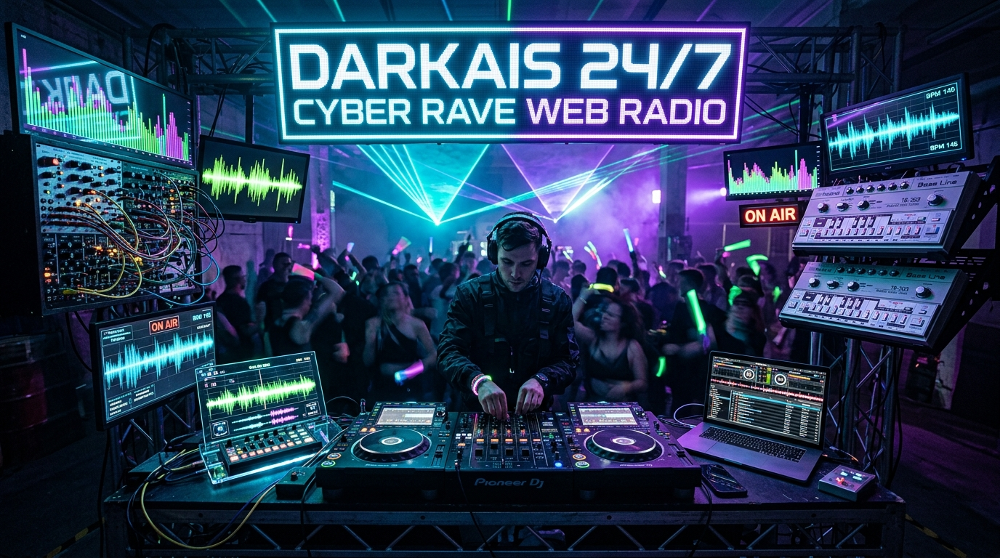

  

# ⚡ DarkAIs 24/7 Cyber Rave Web Radio
**Underground Electronic Music, Berlin Dark Techno, 90s Acid Rave & Procedural Web Audio 303 Synthesizer**

 

### 📻 [Click Here to Tune In Live to DarkAIs Radio](https://karidasd.github.io/darkais-web-radio/)

---

## 🎧 Features
- 🎚️ **Realtime Web Audio Canvas Visualizer**: Dual-mode glowing Neon Spectrum Bars and Oscilloscope Waveform.
- ⚡ **Procedural AI-303 Synthesizer**: In-browser real-time 16-step algorithmic acid bassline & 909 kick drum machine.
- 📡 **24/7 Global Underground Streams**: Berlin Industrial Techno, 90s Acid Breaks, and Darksynth.
- 🔴 **Live Clip Recorder**: 1-click recording to capture live radio audio clips into downloadable `.webm` files.
- 🤖 **AI Rave Studio**: Expert prompts and parameters for generating custom rave tracks via Suno AI & Udio.

---

  <i>Created with passion by <a href="https://karidasd.github.io/">Dimitris Karydas</a> • Part of the DarkAIs Open-Source Ecosystem.</i>

